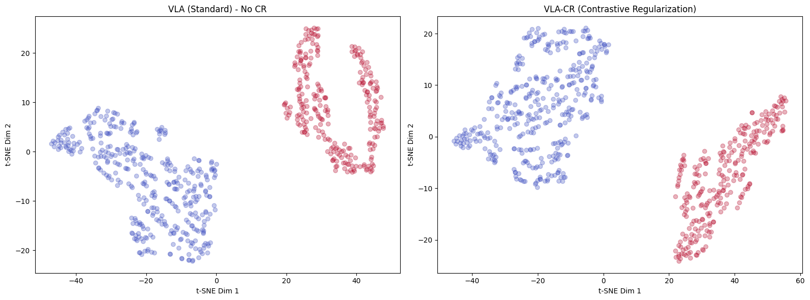

# VLA-CR: Variational Linear Attention with Contrastive Latent Structure

Unofficial PyTorch implementation of **Variational Linear Attention (VLA)**, based on *[Pandey & Singh, 2026](https://arxiv.org/html/2605.11196v1)*, with **Contrastive Regularization (CR)**.

### Overview

This repository extends the original VLA architecture by investigating how to structure the latent memory space for better interpretability.

* **Core VLA Implementation**: Accurate reproduction of `vla_sequential_forward` (Algorithm 1) with adaptive Sherman-Morrison updates.
* **Contrastive Regularization (CR)**: A modified forward pass (`cr=True`) that forces the model to organize its associative memory ($S_t$) based on temporal context.

### Latent Space Explainability
By enforcing **Contrastive Regularization**, we force the model to segregate temporal contexts into distinct manifolds. This renders the latent memory *intrinsically explainable*, as we can map memory trajectories directly to sequence classes.



*Figure: t-SNE visualization of the latent memory manifolds (*$S_t$*) showing segregation by context.*

### Citation

If you use this work, please cite both the original paper and this implementation:

```bibtex
@article{pandey2026variational,
  title={Variational Linear Attention: Stable Associative Memory for Long-Context Transformers},
  author={Pandey, Vishal and Singh, Gopal},
  journal={arXiv preprint arXiv:2605.11196},
  year={2026}
}

@misc{furfaro2026vlacr,
  title={VLA with Contrastive Latent Structure},
  author={Furfaro},
  url={[https://github.com/fabienfrfr/vla](https://github.com/fabienfrfr/vla)},
  year={2026}
}
```

*Disclaimer: This is an experimental implementation investigating latent structure through contrastive learning.*


